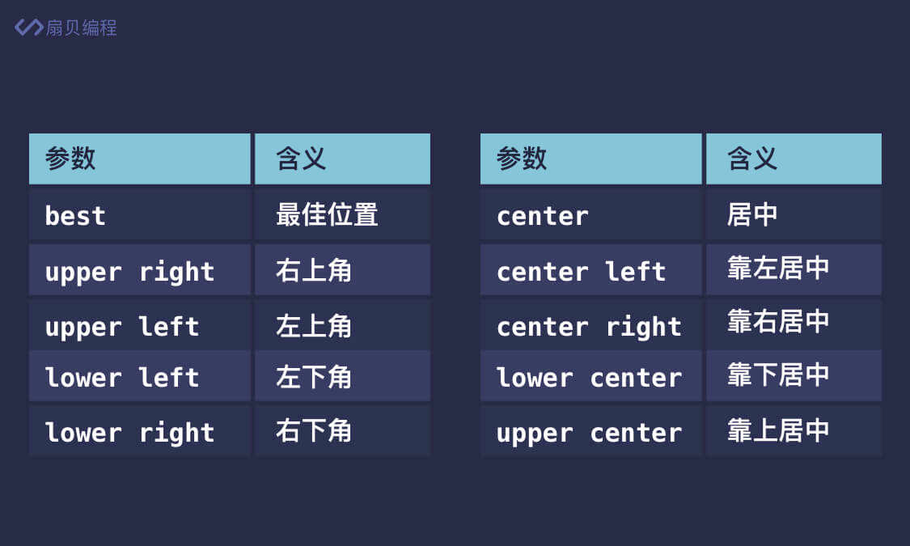
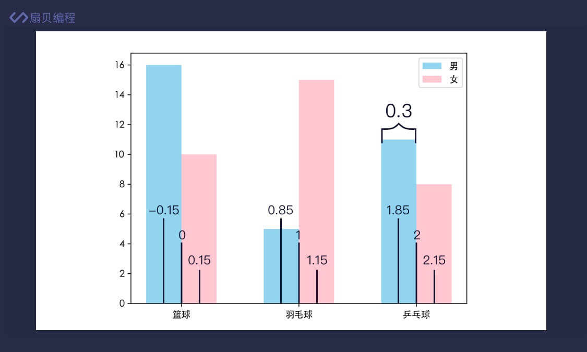

### Matplotlib
通过一下代码引入
```python
import matplotlib.pyplot as plt
```
- 一个例子
```python
import numpy as np
import matplotlib.pyplot as plt  # 导入模块

x = np.arange(0, 2 * np.pi, 0.1)#从0到2PI
y = np.sin(x)# 将值作为x得到y
plt.plot(x, y)# x和y对应匹配至平面直角坐标系
plt.show()
```
还可以为为所画图形设置参数
```python
x = np.arange(0, 2 * np.pi, 0.1)
y1 = np.sin(x)
y2 = np.cos(x)
plt.plot(x, y1, 'ro--')  # 正弦函数图像
plt.plot(x, y2, 'b*-.')  # 余弦函数图像
# 等价于 plt.plot(x, y1, 'ro--', x, y2, 'b*-.')
plt.show()
```
- 以 'ro--' 为例，它分为 3 部分：r 代表红色（red），o 代表的是圆点标记，-- 代表着虚线。ro-- 的意思就是线条为红色虚线、坐标点标记为圆点。

  
- 展示图表大全


1. 绘制折线图
```python
import matplotlib.pyplot as plt

# 时间
x = ['周一', '周二', '周三', '周四', '周五', '周六', '周日']
# 销量
y = [61, 42, 52, 72, 86, 91, 73]
# 设置字体，解决中文乱码问题
plt.rcParams['font.family'] = ['Noto Sans CJK JP']
plt.plot(x, y)
plt.show()
```
可以将多组数据放在同一张表中，并通过图例来区分不同折线
```python
x = ['周一', '周二', '周三', '周四', '周五', '周六', '周日']
y1 = [61, 42, 52, 72, 86, 91, 73]
y2 = [23, 26, 67, 38, 46, 55, 33]
plt.plot(x, y1, label='商品 A')
plt.plot(x, y2, label='商品 B')
# 设置 x 轴标签
plt.xlabel('时间')
# 设置 y 轴标签
plt.ylabel('销量')
# 设置图表标题
plt.title('商品销量对比图')
plt.legend()#展示图例
plt.show()
```
- 图例的定位有11个位置

  
- 也可以标注x轴，y轴的意义，通过plt.xlabel()/plt.ylabel()


2. 绘制柱状图
    plt.bar() 还有一些可选参数，常用的有 width 和 color，分别用于设置柱子的宽度（默认 0.8）和颜色。
```python
names = ['篮球', '羽毛球', '乒乓球']
nums = [26, 20, 19]

plt.bar(names, nums, width=0.6, color='skyblue')
plt.show()
```

3. 堆叠柱状图
- bottom 参数作用就是控制柱状图低端的位置
```python
names = ['篮球', '羽毛球', '乒乓球']
nums_boy = [16, 5, 11]
nums_girl = [10, 15, 8]

plt.bar(names, nums_boy, width=0.6, color='skyblue', label='男')
plt.bar(names, nums_girl, bottom=nums_boy, width=0.6, color='pink', label='女')
plt.legend()
plt.show()
```
4. 分组柱状图
```python
x = np.arange(3)
width = 0.3

names = ['篮球', '羽毛球', '乒乓球']
nums_boy = [16, 5, 11]
nums_girl = [10, 15, 8]

plt.bar(x - width / 2, nums_boy, width=width, color='skyblue', label='男')
plt.bar(x + width / 2, nums_girl, width=width, color='pink', label='女')
plt.xticks(x, names)
plt.legend()
plt.show()
```


5. 饼图

```python
data = [64745.2, 364835.2, 489700.8]
labels = ['第一产业', '第二产业', '第三产业']
explode = (0.1, 0, 0)#要凸显的部分大一点，对应数值就大一点

plt.pie(data, explode=explode, labels=labels, autopct='%0.1f%%')
plt.show()
```
- 一个例子
```python
import matplotlib.pyplot as plt

plt.rcParams['font.family'] = ['Noto Sans CJK JP']

data = [59428036, 263535521, 484750032, 185402141, 68608795, 45625173, 4138550]
labels = ['没上过学', '小学', '初中', '高中', '大学专科', '大学本科', '研究生']

explode=(0,0,0.1,0,0,0,0)

plt.pie(data,explode=explode,labels=labels,autopct='%0.1f')
plt.show()
```

6. 绘制子图
```python
x = np.arange(0, 2 * np.pi, 0.1)

# 子图 1
ax1 = plt.subplot(2, 2, 1)#生成两行两列的子图，并占第一个
y1 = np.sin(x)
ax1.plot(x, y1)

# 子图 2
ax2 = plt.subplot(2, 2, 2)# 生成两行两列的子图，并占第二个
y2 = np.cos(x)
ax2.plot(x, y2)

# 子图 3
ax3 = plt.subplot(2, 1, 2)# 生成两行一列的子图，并占第二个，即占满一行
y3 = np.tan(x)
ax3.plot(x, y3)

plt.show()
```
- 为每个子图设置标题
```python
plt.suptitle('带有子图的图表标题')

ax1 = plt.subplot(2, 2, 1)
ax1.set_title('子图标题')
```