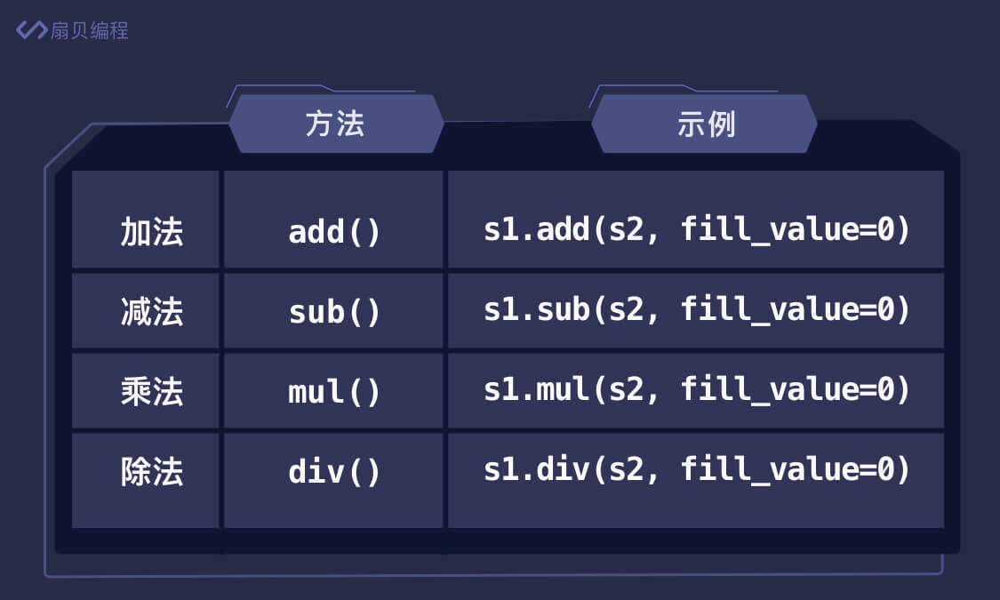
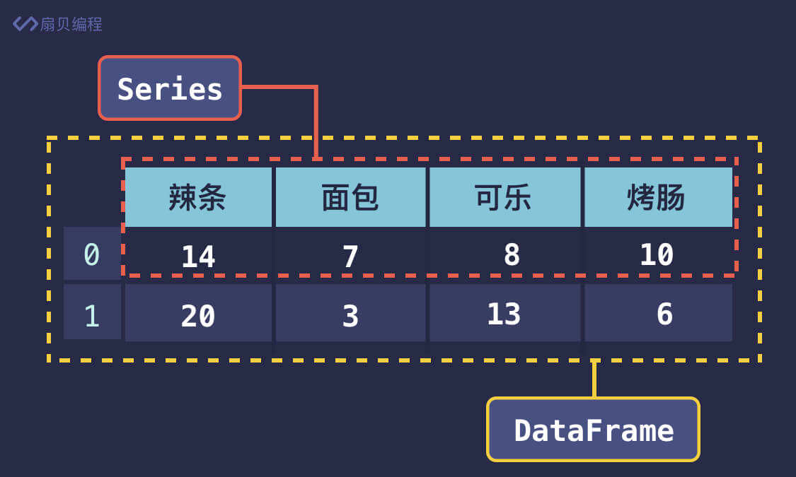
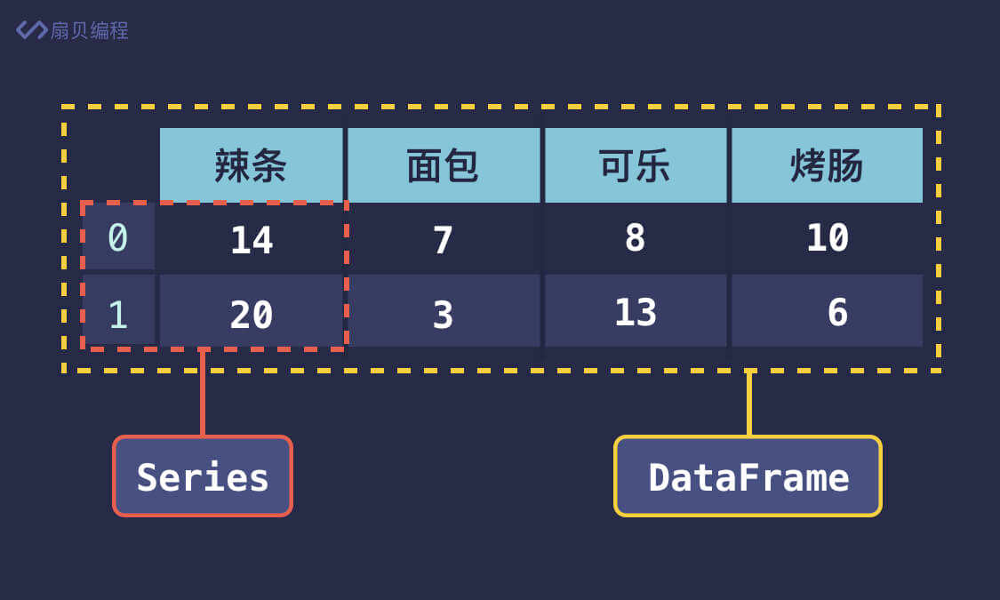

# pandas 

## Seriespppp
    Series 是一种类似于 Numpy 中一维数组的对象，
    它由一组任意类型的数据以及一组与之相关的数据标签（即索引）组成

```python
import pandas as pd

print(pd.Series([2, 4, 6, 8], index=['a', 'b', 'c', 'd']))
#创建一个包含[2,4,6,8]的数字，index=['a','b','c','d']
print(pd.Series({'a': 2, 'b': 4, 'c': 6, 'd': 8}))
#也可以这么写
#输出 
#a    2
#b    4
#c    6
#d    8
#dtype: int64
```

### Series特性  

1. 数据对齐
```python
import pandas as pd

s1 = pd.Series({'辣条': 14, '面包': 7, '可乐': 8, '烤肠': 10})
s2 = pd.Series({'辣条': 20, '面包': 3, '可乐': 13, '烤肠': 6})
print(s1 + s2)
#可以自动将两个索引相同的Series相加
```
即使两个Series数组索引不同也可以相加，只不过要设置有差异的索引的默认值
```python
import pandas as pd

s1 = pd.Series({'辣条': 14, '面包': 7, '可乐': 8, '烤肠': 10})
s2 = pd.Series({'辣条': 20, '面包': 3, '雪碧': 13, '泡面': 6})
print(s1.add(s2, fill_value=0))  # fill_value 为数据缺失时的默认值
#可乐     8.0
#泡面     6.0
#烤肠    10.0
#辣条    34.0
#雪碧    13.0
#面包    10.0
#dtype: float64
```
- 加减乘除都有对应的方法

  
## DataFrame
    可以把 DataFrame 想象成一个表格，表格有行和列这两个维度，所以是二维数据。
    表格中的每一行或每一列都是一个 Series，这些 Series 就组成了 DataFrame。
    按行分，每一行数据加上上面的数据标签就是一个 Series。

    或者按列分，每一列数据加上左边的数据标签也是一个Series


```python
import pandas as pd

#使包含中文时，仍能按表格的形状输出
pd.set_option('display.unicode.ambiguous_as_wide', True)
pd.set_option('display.unicode.east_asian_width', True)

df = pd.DataFrame({'辣条': [14, 20], '面包': [7, 3], '可乐': [8, 13], '烤肠': [10, 6]})
print(df)
```


