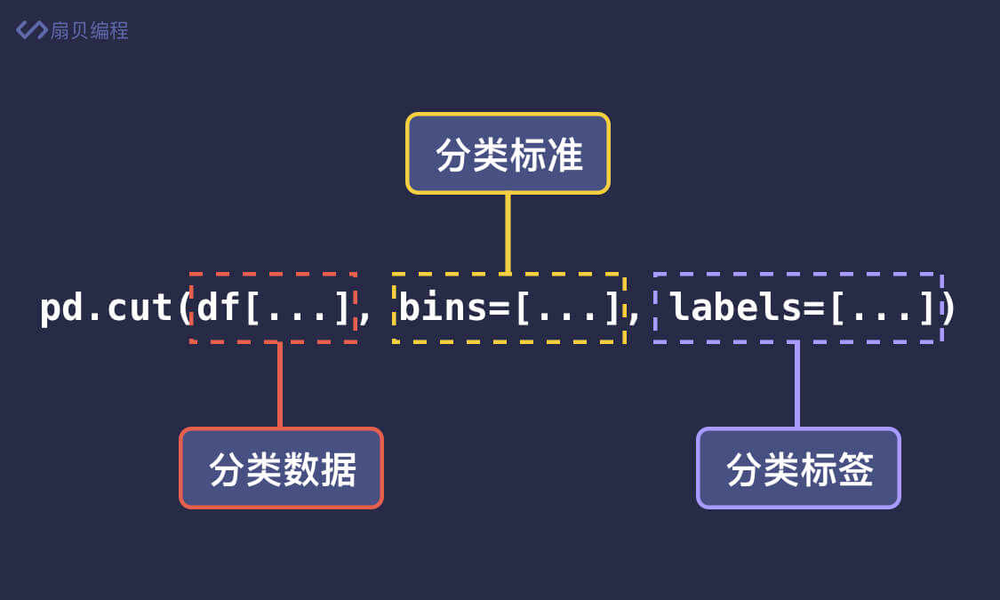
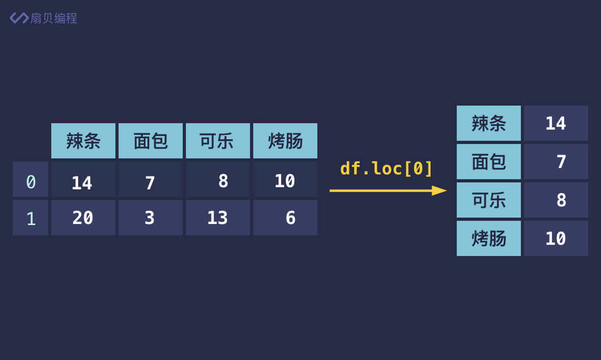
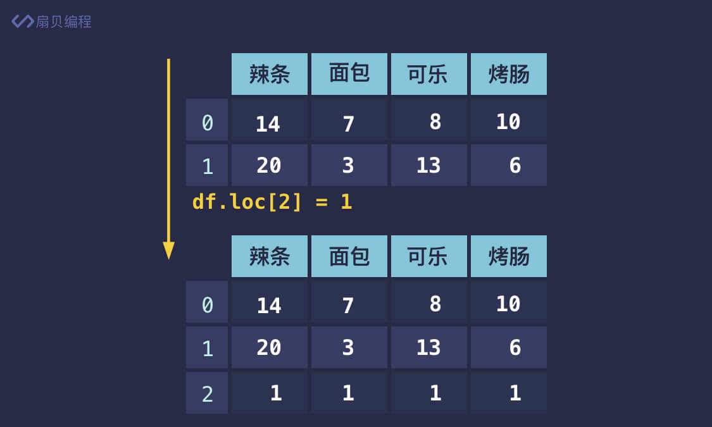

## 数据筛选
- 筛选出低于平均值的元素
```python
df[df['总和'] < df['总和'].mean()]

# 筛选出总和大于 10000 且小于 12000 的
df[(df['总和'] > 10000) & (df['总和'] < 12000)]

# 筛选出总和小于 5000 或大于 12000 的
df[(df['总和'] < 5000) | (df['总和'] > 12000)]
```

## 给数据打标签
```python
pd.cut(df['总和'], bins=[0, 1000, 2000, 3000], labels=['不合格', '良好', '优秀'])
#第一个参数是要分类的列；
#第二个参数 bins 是分类的方式，即分类区间，默认是左开右闭，
#设置 bins=[0, 1000, 2000, 3000]，那对应的分类区间就是 
#(0, 1000]、(1000, 2000] 和 (2000, 3000]。如果你想要左闭右开的方式，可以再添加一个参数 right=False。
#最后的参数 labels 分别对应了这三组的标签名。即 (0, 1000] 表示不合格，(1000, 2000] 表示良好，(2000, 3000] 表示优秀。
```

bins中的数字也可以用表达式来代替
```python
df['绩效'] = pd.cut(df['总和'], bins=[0, df['总和'].mean() * 0.9, df['总和'].mean() * 1.2, df['总和'].max()], labels=['不合格', '良好', '优秀'])
```

## 行的增删改查
### 查看行

- 使用loc[]可以定位到DataFrame中的任一行，类似数组索引
- 也可以使用设置好的index中的值来定位数据
- 还支持第二个参数，用来选中某列数据 print(df.loc[0, '辣条'])
- 还支持行、列分片.分片是前后都包含的闭区间
```python
# 行分片
print(df.loc[0:1, '辣条'])

# 列分片
print(df.loc[0, '辣条':'可乐'])

# 同时分片
print(df.loc[0:1, '辣条':'可乐'])
```
- loc也可以进行布尔索引筛选  df.loc[df['辣条'] > 15]
- print(df.loc[df['辣条'] > 15, ['辣条', '面包']]) 加入第二个参数进一步筛选
### 修改行

直接看代码
```python
df.loc[0] = 1  # 第一行都改成 1
print(df)

df.loc[0] = [1, 2, 3, 4]# 安装位置依次匹配
print(df)
```

### 新增行
- 新增行，只需传入表格中不存在的索引即可。
```python
# 添加第三行，全为 1
df.loc[2] = 1
# 添加第四行，分别为 1 2 3 4
df.loc[3] = [1, 2, 3, 4]
print(df)
```



### 删除行
- 删除行和删除列一样，都是使用 drop() 方法。删除列的使用传入了 axis=1 表示对列进行删除，
- axis 默认为 0，因此删除行时省略 axis 参数即可。
```python
df.drop(0, inplace=True)  # 删除第一行
print(df)
# 或者 print(df.drop(0))
```

- pandas 提供了 groupby() 方法用于数据的分组，第一个参数用于指定按哪一列进行分组。
```python
df.groupby('团队')
df.groupby('团队').sum()
```

```python
sum_by_team = df.groupby('团队').sum()
data =  sum_by_team.loc[sum_by_team['第一季度']<sum_by_team['第一季度'].mean(),'第一季度']
```

