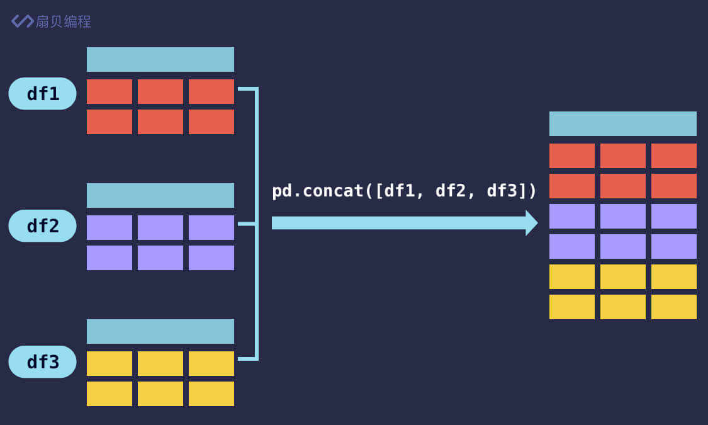
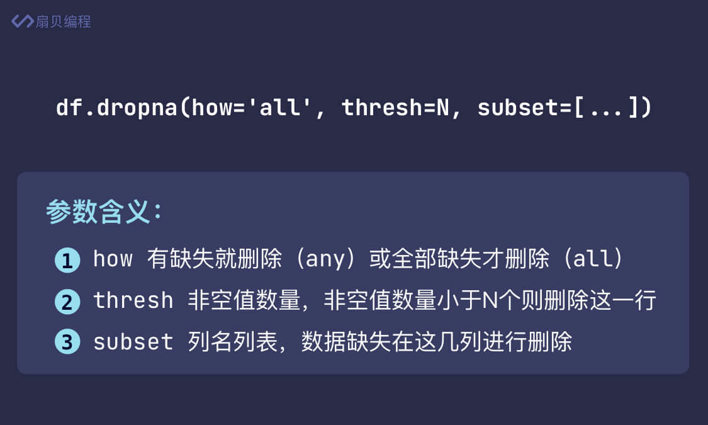
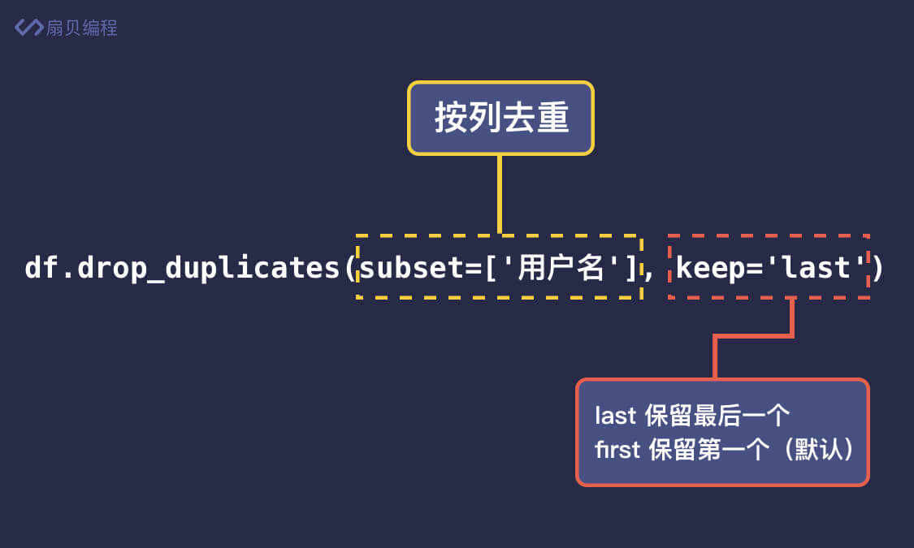
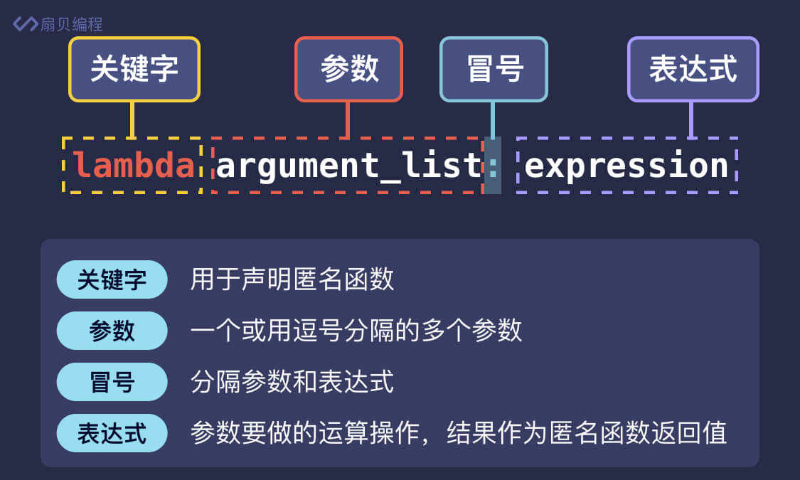
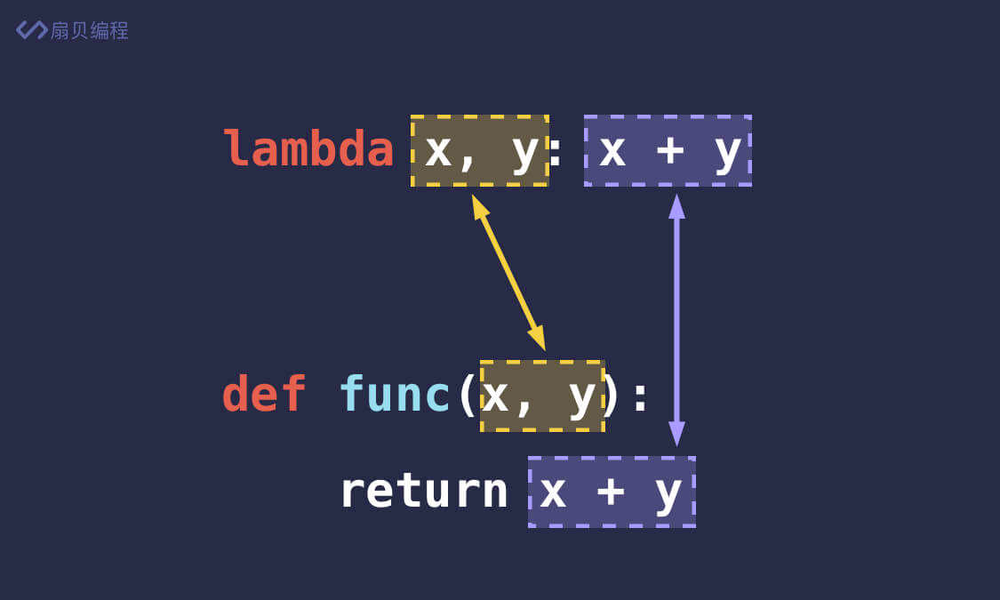

## 表格合并
- 使用pandas的concat方法纵向合并二维表格  
  
  ```python
  #纵向合并
  df = pb.concat（[df_a,df_b,df_c,df_d])
  ```  
  
- 使用pd.merge(表1，表2)来横向合并  
  ```python
    df = pd.merge(df1,df2,on='销售员',how='outer')
  ```
  
    还拥有两个比较重要的参数
  1. on  
     表明用于合并的列名，可以使用列表指定多个列名，这些列名必须同时存在于两个表格当中。如果没有指定参数 on，那么 pandas 会自动将两个表格都有的列名作为参数 on 的值
     
  2. how
    参数 how 指定了合并的方式，总共有 left、right、outer 和 inner 四种方式可选，默认为 inner。
     

## 数据清洗
###### 常见的处理数据缺失的方法有 删除缺失数据行 和 为缺失数据赋值

---

1. 删除缺失数据行  
    ```python
   df.dropna() 
   #dropna() 方法的作用是删除所有包含 NaN 的行
   ```
   dropna() 方法同样也是返回删除后的表格，不会对原表格有影响。如需直接在原表格上删除，传入 inplace=True 即可。


```python
#可以传入 how='all' 来控制当这一行数据都为 NaN 时才删除这一行。how 默认为 any，表示只要有一个 NaN 就会删除这一行。
df.dropna(how='all')

#可以传入 thresh 参数来控制当一行中非空值数量小于多少时才删除此行，比如当一行数据中，非空值数量小于 5 个时删除这一行
df.dropna(thresh=5)

#可以通过 subset 参数决定哪几列有数据缺失时才进行删除。
df.dropna(subset=['书名', '价格'])
```



```python
#比如价格(列)缺失了，我们可以将缺失价格设置为 0
df['价格'].fillna(0)

df['价格'].fillna(df['价格'].mean())
#也可设为平均值，前提是 价格 列均有有效值
```

2. 统一数据格式
    replace是在string中的方法，所以在pandas中需要
```python
    df['价格'] = df['价格'].str.replace('元', '').astype('float')
   #.str.replace()来删除价格列中的'元'
   # .astype()将数据进行类型转换 
   
    df['评分'].fillna(df['评分'].mean().round(1),inplace=True)
    #round(1)表示保留1喂小数
```

3. 去除重复数据
- ```repeat.drop_duplicates()```用于删除重复的行
- ```repeat.drop_duplicates(subset=['用户名'])``` 指定按列去重，只要这一列的数据重复就删除  
    去重默认是保留第一条不重复的数据，如果你想保留最后一条不重复的数据，可以传入 keep='last'。
    ```repeat.drop_duplicates(subset=['用户名'], keep='last')```
  
  
- ```repeat['用户名'].unique()``` 可以知道不重复的数据，返回一个列表

  
- apply() 可以将函数应用到比表格列里的每一个数据中，并将表格数据作为参数传给函数
```python
def format_price(x):
  return float(x.replace('元', ''))

df['价格'] = df['价格'].apply(format_price)

#以及匿名函数
df['价格'] = df['价格'].apply(lambda x: float(x.replace('元', '')))

#将匿名函数赋值给变量
format_price = lambda x: float(x.replace('元', ''))
df['价格'] = df['价格'].apply(format_price)
```




挑选出同评分中，价格最高的书籍信息
```python
import pandas as pd

pd.set_option('display.unicode.ambiguous_as_wide', True)
pd.set_option('display.unicode.east_asian_width', True)

df = pd.read_csv('https://media-image1.baydn.com/storage_media_image/uyacwn/9b55244d1d12455eb86c1720d9b8ee0a.be56cfdf3e51b3b78f101c45c6c89e8f/%E8%B1%86%E7%93%A3%E5%9B%BE%E4%B9%A6top250.csv')

#整体按照价格排序
df.sort_values('价格',inplace=True)
#将评分列去重，仅保留第一个
df.drop_duplicates(subset=['评分'],inplace=True)
print(df)
```

