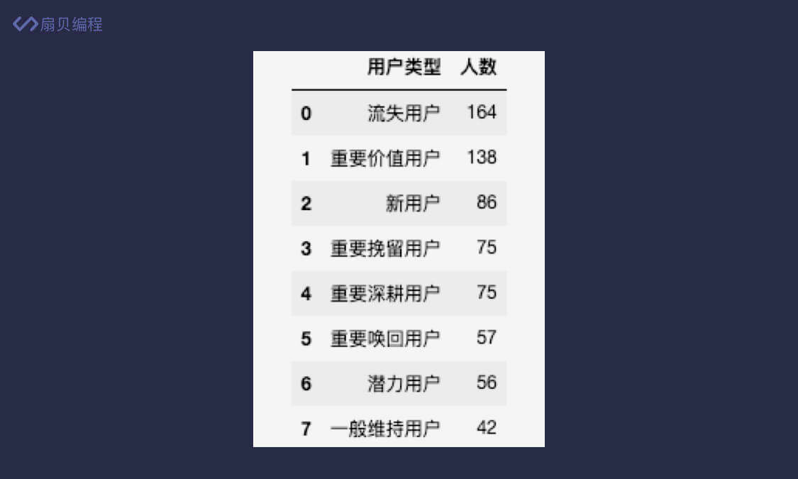

___RFM用户分析模型___  
RFM 是三个英文单词的缩写，分别对应着 Recency、Frequency 和 Monetary
- Recency：最近一次消费，即上一次交易距今多少天，反应了用户是否流失；
- Frequency：消费频率，一段时间内用户的消费频率，反应了用户的消费活跃度；
- Monetary：消费金额，一段时间内用户消费总金额，反应了用户价值。  
  
将这3种用户细分为8种
  
  
对 RFM 用户分析模型来说，只要数据中有用户名、订单日期和订单金额即可
- 下图为例子

  
```python
#读取订单表格文件
df = pd.read_csv('https://media-zip1.baydn.com/storage_media_zip/srfeae/bf6dc7d814c520c60e5e632d281f14a4.ba163c25251bd44b74bde1bb4af7abdc.csv')
print(df.info())
print(df.describe())

#最近一次消费R需要日期时间的计算，需将订单日期这一列自负床转成日期格式
df['订单日期'] = pd.to_datetime(df['订单日期'])

#就可以直接将两日期进行加减
#(pd.to_datetime('2019-12-31') - pd.to_datetime('2019-12-01')).days    = 30
#在计算 RFM 前我们得使用 df.groupby('用户名') 按用户名分组，然后我们使用 agg() 方法一次性计算出 RFM 的值：
#agg() 方法是 pandas 中的聚合方法，可以针对多列同时进行操作。它的用法有很多，这里只介绍参数是字典的用法。
#我们给 agg() 方法传入一个字典，字典的键是要进行操作的列名，值为一个函数。函数的参数是每一列中的数据，
#函数的返回值将替换原来的值。你可以将 agg() 方法理解为同时针对多列进行不同操作的 apply() 方法。
df_rfm = df.groupby('用户名').agg({
  '订单日期': lambda x: (pd.to_datetime('2019-12-31') - x.max()).days,  # 计算 R
  '用户名': lambda x: len(x),  # 计算 F
  '订单金额': lambda x: x.sum()  # 计算 M
})
```

表格中是 2019 年的订单数据，不包含 2020 年的数据，因此在计算 R（最近一次消费）时应该用 2019-12-31 减去用户的最近一次订单日期。  
日期越往后越大，因此调用 max() 方法可以找到该用户最近一次订单日期，最终得到的天数就是 R 的值。  
  
因为时间跨度一样，都是一年。因此 F （消费频率）可以直接用每个用户的订单数量表示。  
按用户名分组后，用户名的个数就是该用户的订单数，因此通过 len() 函数可以直接得到 F 的值。  
  
最后的 M（消费金额）也很简单，分组后直接调用 sum() 方法求和即可得到每个用户这一年的消费金额。  

我们将 agg() 方法返回的新数据存到了 df_rfm 中，这个新表格前 5 条数据长这样：  
  
  
```python
#重命名列名
#因为要修改的是列名，我们给 columns 参数传入一个字典。字典的键是原列表名，对应的值是修改后的列名。改完之后的表格前 5 条数据长这样：
df_rfm.rename(columns={'订单日期': 'R', '用户名': 'F', '订单金额': 'M'}, inplace=True)
```

___RFM打分___  
1. 按照数据的分位数来进行分值的划分  
   df_rfm.describe()查看表格信息  
     
   我们根据图中的分位数来进行分值的划分。以 R 为例，将分为 0 到 29、29 到 58、58 到 119 和 119 到 363 四个区间。  
   因为 R（最近一次消费）越小，说明用户越活跃，打分就越高。因此 R 的打分规则如下：  
     
   同理，F 和 M 的打分规则如下：  
     
     
   
我们定义一个名为 r_score 的函数，然后将 R 值打分的规则写到函数里，最后传给 apply() 方法应用到 R 列上。
```python
def r_score(x):
  if x <= 29:
    return 4
  elif x <= 58:
    return 3
  elif x <= 119:
    return 2
  else:
    return 1

df_rfm['r_score'] = df_rfm['R'].apply(r_score)


#完整代码
import pandas as pd

pd.set_option('display.unicode.ambiguous_as_wide', True)
pd.set_option('display.unicode.east_asian_width', True)

# 读取订单表格数据
df = pd.read_csv('https://media-zip1.baydn.com/storage_media_zip/srfeae/bf6dc7d814c520c60e5e632d281f14a4.ba163c25251bd44b74bde1bb4af7abdc.csv')
# 将订单日期转为日期格式
df['订单日期'] = pd.to_datetime(df['订单日期'])
# 计算 RFM
df_rfm = df.groupby('用户名').agg({
  '订单日期': lambda x: (pd.to_datetime('2019-12-31') - x.max()).days,  # 计算 R
  '用户名': lambda x: len(x),  # 计算 F
  '订单金额': lambda x: x.sum()  # 计算 M
})
# 列名重命名
df_rfm.rename(columns={'订单日期': 'R', '用户名': 'F', '订单金额': 'M'}, inplace=True)

def r_score(x):
  if x <= 29:
    return 4
  elif x <= 58:
    return 3
  elif x <= 119:
    return 2
  else:
    return 1

def f_score(x):
  # 补充 f 的打分规则
  if x <=1:
    return 1
  elif x <= 2:
    return 2
  elif x<=3:
    return 3
  else:
    return 4
def m_score(x):
  # 补充 m 的打分规则
  if x <=204:
    return 1
  elif x<=606:
    return 2
  elif x<=1334:
    return 3
  else:
    return 4

df_rfm['r_score'] = df_rfm['R'].apply(r_score)
# 计算 f_score 和 m_score
df_rfm['f_score'] = df_rfm['F'].apply(f_score)
df_rfm['m_score'] = df_rfm['M'].apply(m_score)

print(df_rfm.head())
```
2. 依据数据和业务的理解进行分值的划分  
  
---

___简化rfm结果___  
我们将大于平均值的定义为高，小于等于平均值的定义为低，这样就能将 64 种结果简化为 8 种了  
```python
df_rfm['R高低'] = df_rfm['r_score'].apply(lambda x: '高' if x > df_rfm['r_score'].mean() else '低')
df_rfm['F高低'] = df_rfm['f_score'].apply(lambda x: '高' if x > df_rfm['f_score'].mean() else '低')
df_rfm['M高低'] = df_rfm['m_score'].apply(lambda x: '高' if x > df_rfm['m_score'].mean() else '低')

df_rfm['RFM'] = df_rfm['R高低'] + df_rfm['F高低'] + df_rfm['M高低']
```
  
```python
def rfm_type(x):
  if x == '高高高':
    return '重要价值用户'
  elif x == '低高高':
    return '重要唤回用户'
  elif x == '高低高':
    return '重要深耕用户'
  elif x == '低低高':
    return '重要挽留用户'
  elif x == '高高低':
    return '潜力用户'
  elif x == '高低低':
    return '新用户'
  elif x == '低高低':
    return '一般维持用户'
  elif x == '低低低':
    return '流失用户'

df_rfm['用户类型'] = df_rfm['RFM'].apply(rfm_type)
```


  
___结果分析___
```python
df_rfm['用户类型'].value_counts()
```
value_counts() 方法返回的数据类型是 Series，左边是数据标签（索引），右边是对应的数据。  
我们可以使用 reset_index() 方法将现有的数据标签（索引）变成数据，并使用默认的数字索引（从 0 开始）作为新的索引。  
简单来说就是 reset_index() 方法将 Series 变成了 DataFrame。
```python
df_count = df_rfm['用户类型'].value_counts().reset_index()
df_count.rename(columns={'index': '用户类型', '用户类型': '人数'}, inplace=True)
```
  
```python
df_count['占比'] = df_count['人数'] / df_count['人数'].sum()  # 人数/总人数
df_count.plot(kind='bar', x='用户类型', y=['人数'])
plt.show()  # 需要提前 import matplotlib.pyplot as plt
```
使用 pandas 中的 plot() 方法即可将我们的数据快速的进行可视化，它的参数有很多，这里只介绍几个常用的。
- kind：图表类型，默认为 line（折线图）。还可以设置为 bar（柱状图）、barh（水平柱状图）、hist（直方图）、box（箱形图）、kde（核密度估计图）、area（面积图）、pie（饼图）、scatter（散点图）和 hexbin（六边形图）；
- x：x 轴数据，即横轴数据；
- y：y 轴数据，即纵轴数据，可以设置多个。  

我们也可以不使用 kind 参数，直接使用 plot 上对应的方法来绘图。  
比如：df_count.plot.bar(x='用户类型', y=['人数'])，它和 df_count.plot(kind='bar', x='用户类型', y=['人数']) 是等价的，写起来更加方便一些，对于其他图标类型也同样适用。

```python
import pandas as pd
import matplotlib.pyplot as plt

plt.rcParams['font.family']=['Noto Sans CJK JP']
pd.set_option('display.unicode.ambiguous_as_wide', True)
pd.set_option('display.unicode.east_asian_width', True)

# 读取订单表格数据
df = pd.read_csv('https://media-zip1.baydn.com/storage_media_zip/srfeae/bf6dc7d814c520c60e5e632d281f14a4.ba163c25251bd44b74bde1bb4af7abdc.csv')
# 将订单日期转为日期格式
df['订单日期'] = pd.to_datetime(df['订单日期'])
# 计算 RFM
df_rfm = df.groupby('用户名').agg({
    '订单日期': lambda x: (pd.to_datetime('2019-12-31') - x.max()).days,  # 计算 R
    '用户名': lambda x: len(x),  # 计算 F
    '订单金额': lambda x: x.sum()  # 计算 M
})
# 列名重命名
df_rfm.rename(columns={'订单日期': 'R', '用户名': 'F', '订单金额': 'M'}, inplace=True)

def r_score(x):
  if x <= 29:
    return 4
  elif x <= 58:
    return 3
  elif x <= 119:
    return 2
  else:
    return 1

def f_score(x):
  if x <= 1:
    return 1
  elif x <= 2:
    return 2
  elif x <= 3:
    return 3
  else:
    return 4

def m_score(x):
  if x <= 204:
    return 1
  elif x <= 606:
    return 2
  elif x <= 1334:
    return 3
  else:
    return 4

df_rfm['r_score'] = df_rfm['R'].apply(r_score)
df_rfm['f_score'] = df_rfm['F'].apply(f_score)
df_rfm['m_score'] = df_rfm['M'].apply(m_score)

df_rfm['R高低'] = df_rfm['r_score'].apply(lambda x: '高' if x > df_rfm['r_score'].mean() else '低')
df_rfm['F高低'] = df_rfm['f_score'].apply(lambda x: '高' if x > df_rfm['f_score'].mean() else '低')
df_rfm['M高低'] = df_rfm['m_score'].apply(lambda x: '高' if x > df_rfm['m_score'].mean() else '低')

df_rfm['RFM'] = df_rfm['R高低'] + df_rfm['F高低'] + df_rfm['M高低']

def rfm_type(x):
  if x == '高高高':
    return '重要价值用户'
  elif x == '低高高':
    return '重要唤回用户'
  elif x == '高低高':
    return '重要深耕用户'
  elif x == '低低高':
    return '重要挽留用户'
  elif x == '高高低':
    return '潜力用户'
  elif x == '高低低':
    return '新用户'
  elif x == '低高低':
    return '一般维持用户'
  elif x == '低低低':
    return '流失用户'

# 给用户打标签
df_rfm['用户类型'] = df_rfm['RFM'].apply(rfm_type)

#获取每类用户的消费金额
df_monetary = df_rfm.groupby('用户类型')['M'].sum().reset_index()
#作图
df_monetary.plot.bar(x='用户类型',y=['M'])
plt.show()
```